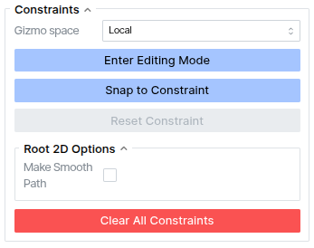
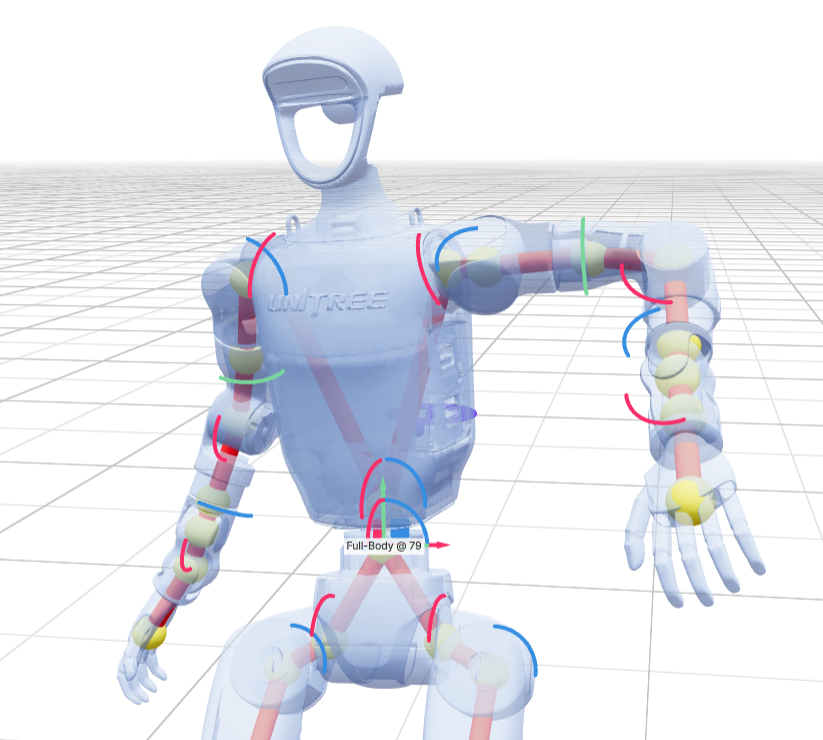

# Constraints

Constraints guide the motion at specific frames or intervals. To learn about the types of constraints details of each, see the [constraints concepts](../key_concepts/constraints.md) and [constraints format](../user_guide/constraints.md) pages.

The constraint panel allows you to configure constraints and editing:

- **Enter Editing Mode**: enable FK pose editing in the viewer. Gizmos will be displayed on joints that can be edited. If there is already a constraint on the timeline for the current frame, any pose editing will adjust that constraint, otherwise you need to add a constraint on the timeline after adjusting the pose.
- **Gizmo space**: whether to display the rotation gizmos in local or global joint space while editing
- **Snap to Constraint**: will snap the current frame of motion to the constraint at that frame. This can be useful if a generated pose does not exactly meet the constraint and you want to continue editing the constraint.
- **Reset Constraint**: does the opposite by snapping the pose back to the original generated motion from the constrained pose.
- **Root 2D Options > Make Smooth Path**: if you have laid down root waypoint constraints, checking this box will turn the waypoints into a smoothed dense path constraint. If there is not a waypoint at the first and last frames of the motion, they will be automatically added since Kimodo is only trained on full-sequence paths.
- **Clear All Constraints**: clears all current constraints from the viewer and timeline.
