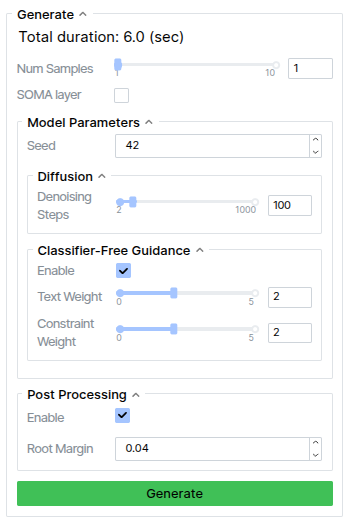

# Generation

The most important panel is the "Generate" which allows you to call Kimodo to generate one or more motions based on the prompts, constraints, and settings provided.

- **Num Samples**: the number of motions to generate based on the current settings. When multiple samples are generated, you _must_ choose a single sample by clicking the character in the viewer before editing constraints or generating new motion.
- **SOMA Layer**: if using a `Kimodo-SOMA` model, this option will appear. It allows you to use the SOMA body layer to skin the character instead of using the SOMA rig. For details on the difference between the two, see the [Skeletons page](../key_concepts/skeleton.md#soma-default).
- **Seed**: random seed for repeatable generation
- **Denoising steps**: number of steps to use with DDIM
- **CFG Text/Constraint Weight**: the weights to use for classifier-free guidance
- **Post-Processing**: whether to use foot skate cleanup and constraint post-optimization to improve motion after generation
    - **Root Margin**: if the skeleton root deviates more than this margin from a constraint, the post-processing will fix it
