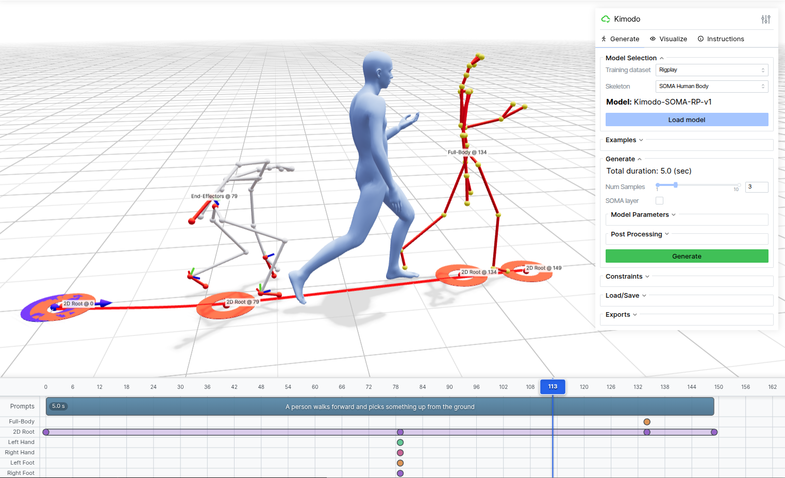

# Interactive Demo

The web-based interactive demo provides an intuitive interface for generating motions with any of the Kimodo model variations.


*Interactive demo interface build with [Viser](https://github.com/viser-project/viser)*

```{note}
To see the demo in action, follow the [setup instructions](launching.md) below and launch it locally. After launching, open the demo in a web browser at http://127.0.0.1:7860 or use port forwarding if running on a server.
```

The demo provides a timeline-based interface for composing text prompts and
constraints, with real-time 3D visualization. Here are some key features:

- **Multiple Characters**: Supports generating with the SOMA, G1, and SMPL-X versions of Kimodo
- **Text Prompts**: Enter one or more natural language descriptions of desired motions on the timeline
- **Timeline Editor**: Add and edit keyframes and constrained intervals on multiple constraint tracks
- **Constraint Types**:
  - Full-Body: Complete joint position constraints at specific frames
  - 2D Root: Define waypoints or full paths to follow on the ground plane
  - End-Effectors: Control hands and feet positions/rotations
- **Constraint Editing**: Editing mode allows for re-posing of constraints or adjusting waypoints
- **3D Visualization**: Real-time rendering of generated motions with skeleton and skinned mesh options
- **Playback Controls**: Preview generated motions with adjustable playback speed
- **Multiple Samples**: Generate and compare multiple motion variations
- **Examples**: Load pre-existing examples to better understand Kimodo's capabilities
- **Export**: Save constraints and generated motions for later use


## Quick Links

- [Starting the Demo](launching.md)
- [UI Overview](ui_overview.md)
- [Examples](examples.md)


```{toctree}
:maxdepth: 2
:hidden:

launching
ui_overview
model_selection
examples
generation
constraints
export_results
```
