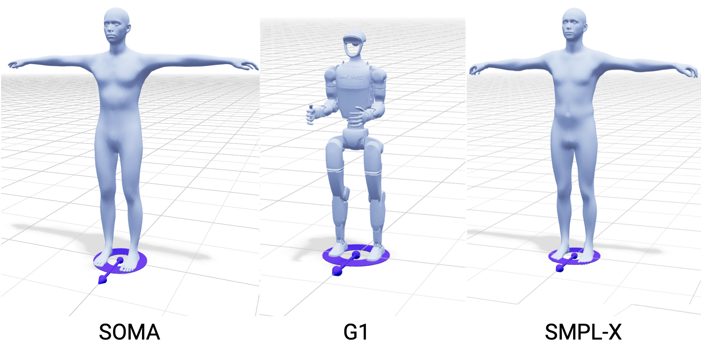

# Model Selection

Model selection allows choosing between the Kimodo models detailed in the [quick start guide](../getting_started/quick_start.md#overview-kimodo-models).

The models determine which character is loaded in the scene and the possible export options.

- **SOMA**: default human skeleton
- **G1**: MuJoCo-compatible exports
- **SMPL-X**: SMPL-X compatible outputs

For details on each skeleton, see [Skeletons](../key_concepts/skeleton.md).

