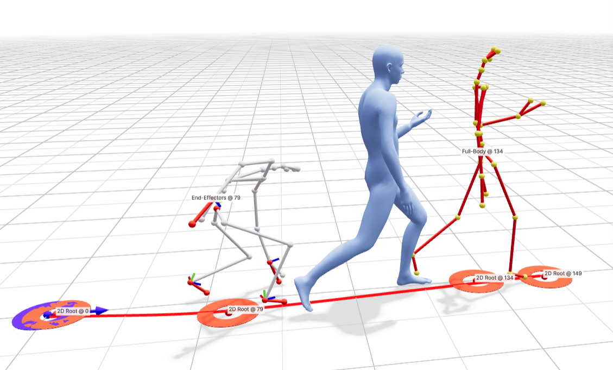
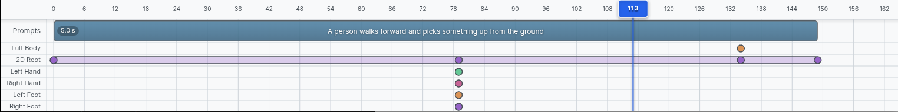

# UI Overview

This page gives an overview of each of the main elements of the demo UI and how to use them.

*An example scene within the demo webapp*

## Viewer

The 3D viewer shows the currently generated motion. It supports skeleton or skinned mesh rendering, which is configurable in the "Visualize" panel.

### Camera
- **Left-drag**: rotate
- **Right-drag**: pan
- **Scroll**: zoom

### Playback
- **Space** to play/pause
- **←/→** to step frames, or click the frame number.

## Timeline

The timeline is where you:

- add, edit, and delete **prompt segments**
- add and delete **constraints** at frames or intervals and adjust timing

### Timeline Navigation
- **Scroll Up/Down** in the timeline: move left/right
- **Shift + Scroll** in the timeline: zoom in/out

### Prompts
- **Double-Click** a text prompt to edit the text
- **Click and Drag** the right edge of a prompt box to extend/shorten it (2-10 sec)
- **Click Empty Space** to add a prompt
- **Right-Click** a prompt to delete it

### Constraints
Constraints can be added after generating for the first time when there is an active motion in the viewer:
- **Click** in the timeline tracks (Full-Body / 2D root etc) to add a constraint of that type using the pose at that frame
- **Ctrl/Cmd + Click + Drag** to add an interval constraint, or expand a keyframe into an interval
- **Click + Drag** an existing constraint to move it to a different frame
- **Right-Click** on a constraint to delete it
- To **edit** a constraint:
    - Move playback to the target frame
    - Click **Enter Editing Mode** in the Constraints tab of the Settings Panel. Note you must exit editing mode before generating again.

## Settings Panel

The settings panel includes:
- model selection
- loading examples
- model parameter selection for generation and post-processing
- parameters for constraint editing
- motion loading and saving
- visualization options

Important settings panels are individually explained on subsequent pages.
