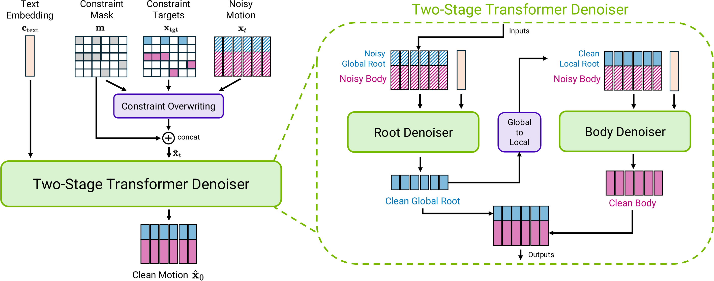

# Model Overview

At a glance:
- Input: text prompt + optional constraints.
- Output: full-body motion sequence
- Core Idea: denoise motion features with a two-stage transformer at each step.

Kimodo is an explicit motion diffusion model that generates 3D human motion by denoising a sequence of skeleton poses. The model operates on a carefully designed motion representation that enables precise control over generated motion while minimizing common artifacts, such as floating and foot skating. The motion representation features a smoothed root that emulates paths drawn in practical animation tools, along with global joint rotations and positions amenable to sparse keyframe constraints.

For full details, see the [tech report](https://research.nvidia.com/labs/sil/projects/kimodo/assets/kimodo_tech_report.pdf)

## Diffusion Process

At each step of the denoising process, the model takes in an embedding of the text prompt, a set of kinematic constraints, and the current noisy motion. Constraints are specified using the same motion representation as the input motion, and are used to overwrite the corresponding values in the noisy motion. Additionally, a mask indicating which elements are constrained is concatentated to the input motion. The goal is to predict a clean version of the input motion.

## Two-Stage Transformer Denoiser

Given these inputs, the two-stage transformer denoiser predicts a clean motion that aligns with the text and constraints. The two-stage denoiser decomposes root and body motion prediction: the root denoiser first predicts global root motion, which is transformed into a local representation as input to the body denoiser. The final output is the concatenation of the two stages.

## Training Dataset

A key component to effectively train Kimodo is the [Bones Rigplay](https://bones.studio/ai-datasets/) dataset, a large studio mocap dataset containing over 700 hours of production-quality human motion with corresponding text descriptions. The data covers locomotion, gestures, everyday activities, common object interactions, videogame combat, dancing, and various styles including tired, angry, happy, sad, scared, drunk, injured, stealthy, old, and childlike.
