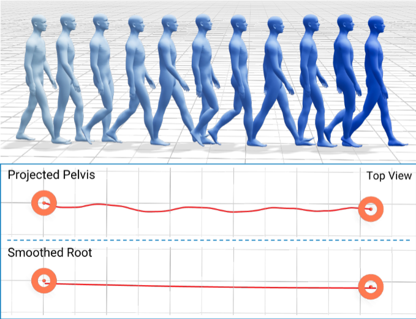

# Motion Representation

Kimodo uses a motion representation that combines a smoothed root representation with global joint positions, rotations, and various auxiliary features.
For full details, please refer to the [tech report](https://research.nvidia.com/labs/sil/projects/kimodo/assets/kimodo_tech_report.pdf).

The representation is implemented in `kimodo/motion_rep/reps/kimodo_motionrep.py` and allows easily going to and from this feature representation.

## Coordinate System

All motion features use a right-handed coordinate system with:

- **Y up**
- **+Z forward**

## Smoothed Root Representation

We use a smoothed root trajectory for the global root position to make
path-following constraints more natural and controllable. Smoothing removes
high-frequency pelvis jitter while preserving overall motion direction, so
2D waypoints or paths drawn by users remain clean and easy to match during
generation, while the pelvis can still move naturally around the smoothed
curve.

## Pose Feature

At each frame, the pose feature vector is the concatenation of:

- **Smooth root position** (`smooth_root_pos`, 3): Smoothed pelvis/root position.
  The x/z components track ground-plane motion and y stores height.
- **Global root heading** (`global_root_heading`, 2): `[cos(theta), sin(theta)]`
  heading direction of the root.
- **Local joint positions** (`local_joints_positions`, `J x 3`): Joint positions
  in a pelvis-relative space with the smoothed root x/z offset applied.
- **Global joint rotations** (`global_rot_data`, `J x 6`): 6D rotation
  representation of each joint's global orientation.
- **Joint velocities** (`velocities`, `J x 3`): Global joint velocities.
- **Foot contacts** (`foot_contacts`, 4): Binary contact indicators for the
  left/right foot contact points.
